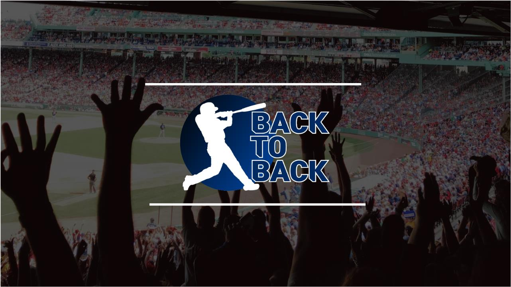
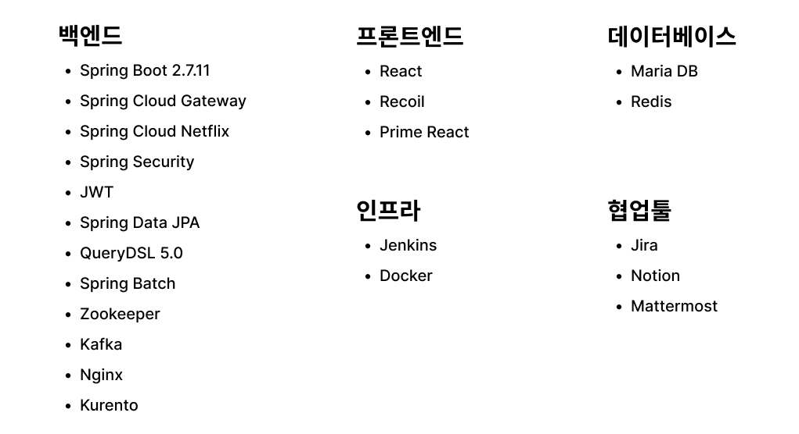
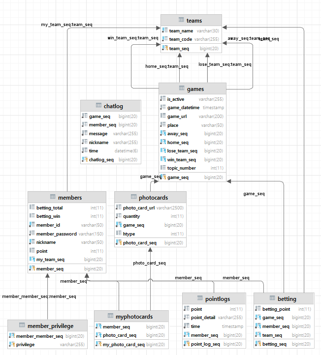
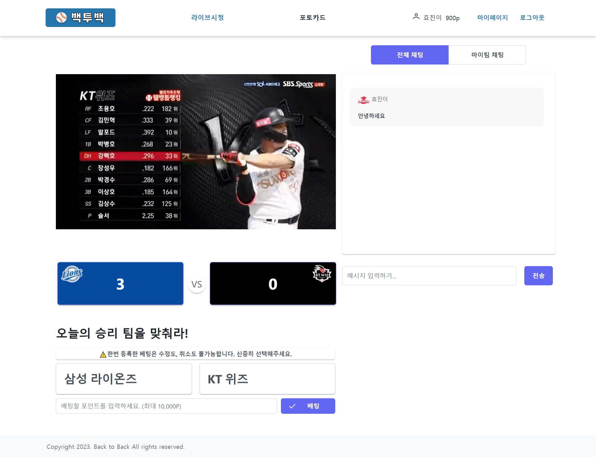
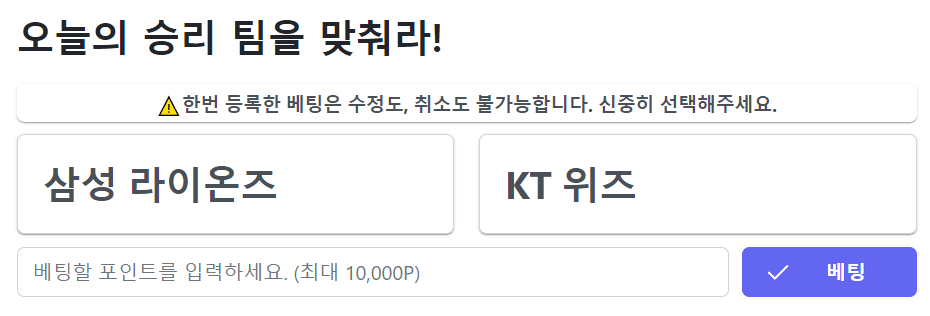
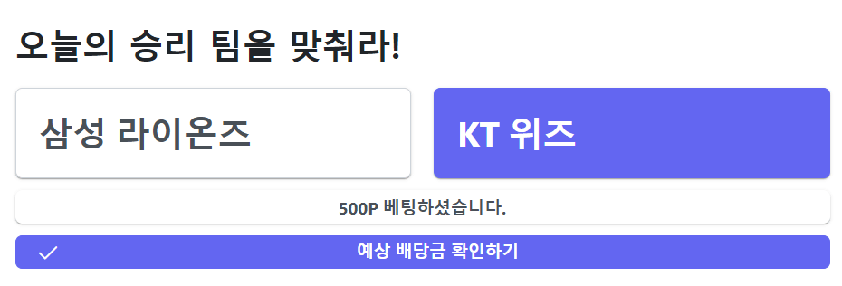
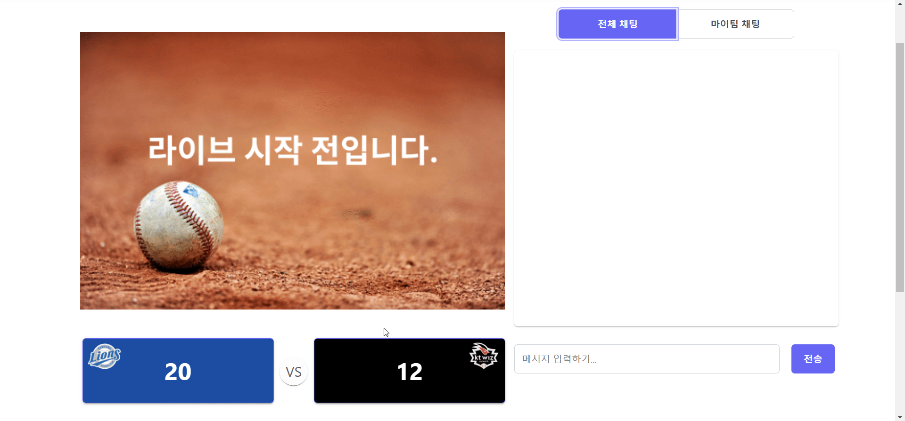
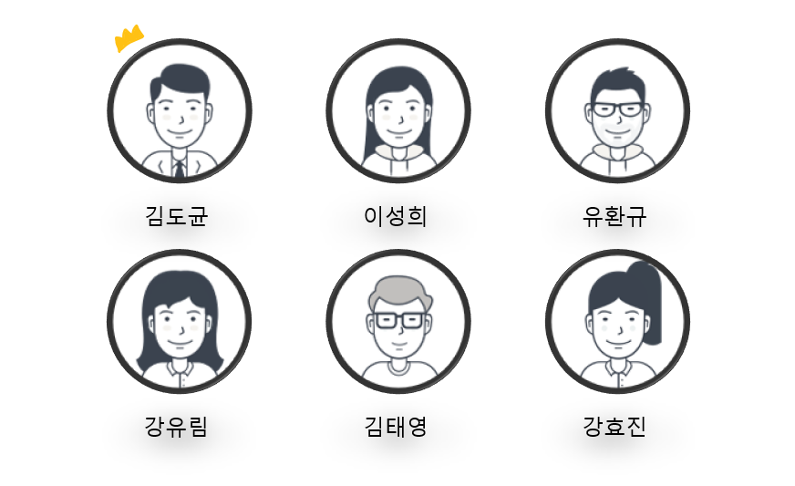

  

# 서비스 소개
### KBO 시장 주 고객인 MZ 세대를 타겟팅
- KBO 리그 실시간 스트리밍 중계 (저작권 문제로 영상으로 대체하여 구현)
- 베팅 : 서비스 자체 포인트 제도로 건전한 확률 게임 도입
- 하이라이트 포토카드 : 실시간으로 생성되는 하이라이트 짤을 포인트로 랜덤 구매하며 경기 종료 후에도 지속적인 흥미 유발

### 재미 요소
- 일반 채팅 & 팀 채팅 : 모든 시청자와 소통할 수 있는 채팅과 더불어 본인의 응원팀 시청자와 소통할 수 있는 팀 채팅 존재
- 응원 : 경기를 시청하며 팬들 간 경쟁적 요소 도입

  

# 기술스택

  

# 아키텍처

  

# ERD

  

# 주요 기능
## 실시간 스트리밍

### 📺 **라이브 중계**

      Kurento Media Server를 사용하여 비디오 스트리밍 환경 구축

 

### 💵 **포인트 베팅**

      예상 승리팀에 포인트를 베팅하고, 경기 결과에 따라 배당금을 지급받는 Restful API 개발

 

### 🥁 **응원**

      Websocket을 사용하여 원하는 팀을 클릭하여 응원하는 서비스 구현

 
 
### 💌 **채팅**

       STOMP(Websocket), Kafka를 사용하여 전체 채팅 / 마이팀 채팅 구현

 

## 하이라이트 포토카드

### ✨ **하이라이트 생성**

       채팅 데이터 추이를 분석하여 하이라이트 시간대 추출 → 비디오를 .GIF로 변환

 

### 🖼️ **포토카드 구매**

       유저의 포인트를 차감하여 카드를 구매하는 Restful API 개발

  

# 팀원 소개

